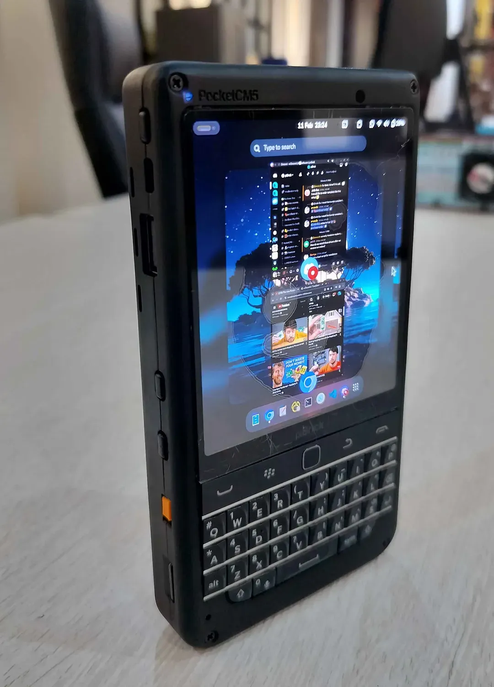
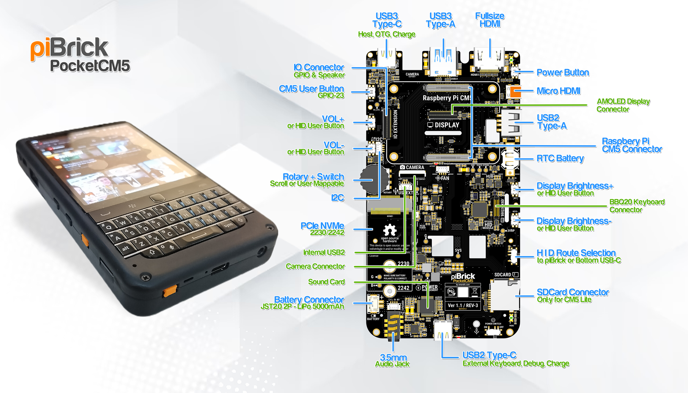

# piBrick Pocket-CM5

**piBrick Pocket-CM5** is a smartphone-sized handheld PC powered by the **Raspberry Pi CM5**, featuring a 3.92" AMOLED touch display and a QWERTY keyboard+trackpad from **BBQ20**.

This pocket computer is compact enough for mobile use, yet powerful and versatile for everyday computing. With its wide range of ports, it can be connected to a desktop setup and used as a full desktop computer.

**piBrick Pocket-CM5** is an Open Source Hardware.

**piBrick Pocket-CM5** is a great tool for engineers, sysadmins, and hackers.
The built-in QWERTY keyboard can function as an external USB keyboard and mouse — simply plug it into another computer or server and use it as a USB-HID device.
It runs a full Linux desktop with unlimited system administration and hacking tools, making it a compact yet complete on-site tool for your work.

There are many possible use cases for this device. It’s a building block — your creativity is the only limit.

This device was designed for manufacturing at JLCPCB, including component selection, design rules, and overall manufacturability. Anyone can easily order and assemble it through JLCPCB.

# Specifications:
- CORE: **Raspberry Pi CM5**
- Dimensions: **80 × 145 × 19.6 mm**
- Display: **3.92" AMOLED Multitouch — MIPI/DSI, 1080×1240 @ 90 Hz, 16M colors, 450nits**
- Display Output: **Full-size HDMI + micro-HDMI**
- **USB:**
  - 1× USB 3 Type-A
  - 1× USB 3 Type-C
  - 1× USB 2 Type-C
  - 1× USB 2 Type-A
  - 1x USB 2 for Internal Add On
- Battery: **5000mAh LiPo Battery**
- **HID:**
  - BBQ20 QWERTY keyboard with integrated trackpad as mouse
  - Side rotary encoders with push switch
  - 5x Side User Buttons
- **Audio:**
  - Internal Sound Card with Amplifier
  - Internal Stereo speaker
  - Microphone from BBQ20 Keyboard
  - 3.5mm audio jack for headphone
- Accelerometer sensor
- Front camera (Raspberry Pi MIPI/CSI camera)
- **Storage**
  - Internal CM5 eMMC or Micro SD
  - M.2 NVMe Connector for SSD
- **Expansion Connector**
  - Internal USB 2.0
  - I2C Connector
  - GPIO Extension Connector
- User RGB LED, and Keyboard Layout RGB Indicator
- Body: **Open Source 3D printable frame & casing**

# Additional Peripherals
- **Mandatory**
  - Raspberry Pi CM5 (Lite or with eMMC) — Wireless version is recommended  
    (Active or passive heatsink also required)  
    https://www.raspberrypi.com/products/compute-module-5/?variant=cm5-104032
  - BlackBerry Q20 keyboard (find from online stores)
  - LiPo battery 5000 mAh with JST-2.0 mm connector
  - 3.92" AMOLED display with touchscreen from DXQ  
    https://dxq-lcd.com/products/1080x1240-3-92-inch-amoled-display
- **Optional**
  - Raspberry Pi Zero Camera  
    https://www.waveshare.com/rpi-zero-v1.3-camera.htm
  - NVMe SSD (size **2230** or **2242**)

# Links
- 🛟 piBrick Discord: https://discord.gg/e9qUdJ4aVr
- 🤖 My Github: https://github.com/amarullz/
- 🤖 piBrick Github: https://github.com/amarullz/piBrick
- 🔬 OSHWLab (PCB and Schematic): https://oshwlab.com/amarullz/pibrick-pocketcm5
- 📺 Youtube: https://www.youtube.com/@amarullz
- 💝 Donation: https://paypal.me/amarullz

# Resources
- ⌨️ Keyboard Firmware: https://github.com/amarullz/pibrick_pocketcm5_keyboard

# Demo & Videos
- Transparent Case Demo: https://www.youtube.com/watch?v=TcVaFZuxn5k
- Generic piBrick Usage Demo: https://www.youtube.com/watch?v=Aw_k3M_BDMw&t=139s
- No-Script Assembly: https://www.youtube.com/watch?v=2-Dx861esv8&t=6s
- Front and Display Assembly Guide: https://www.youtube.com/watch?v=K_VT_-nSvu0&t=200s

# Sponsored By
Thanks **OSHWLAB** Starts to make this project possible, **EasyEDA Pro** is rocks, and **JLCPCB** integration with EasyEda is awesome.

- OSHWLab: https://oshwlab.com/
- EasyEDA: https://easyeda.com/
- JLCPCB: https://jlcpcb.com/
